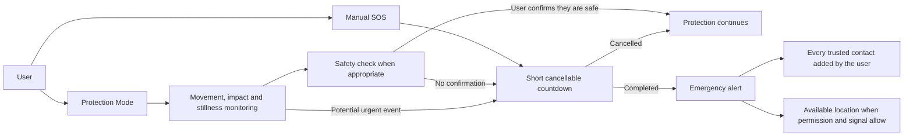

# Garly

**A privacy-first AI safety companion for everyday life.**

Garly is an AI-powered personal safety project designed to support people during everyday activities such as walking alone, commuting, travelling and outdoor exercise.

## Current development

Garly is on Google Play in testing, and an iPhone build is heading to review.

**Protection**

- Protection Mode with motion, impact and free-fall detection, calibrated on real phones
- Background monitoring, in a foreground service the person starts and can always stop
- Trusted-contact SOS alerts, with a countdown that can be cancelled
- Walk mode: a dead man's switch Garly can arm, and never fires on its own
- Live location sharing, stoppable from any screen and from its own notification
- Stillness detection with a timer the person chooses
- Adjustable sensitivity, with jogging and bag movement profiles
- An opt-in acoustic feature, with the clip encrypted on the phone and deleted after 24 hours

**The companion side**

- Private memory that saves a routine only when the person approves it, one line at a time
- Eight characters, and one safety rule that overrides all of them
- Nine evolutions, paced over months rather than days
- Parental mode: a PIN a parent sets, a child-safe chat, and a notice to the trusted
  contact that carries the danger category and nothing else

**Privacy**

- Privacy Lock for sensitive screens, with a separate PIN that survives a reinstall
- Two-factor authentication
- Export or delete your data, or delete the account
- Ten complete languages across the app, the site and the legal pages

Garly is developed through real-device testing. Detection systems continue to be
calibrated to reduce false alarms and missed events, and what the screen says about
them is held to one rule: nothing may claim a state it did not read. If the sensors
stopped, the app says so. If a Focus can hold an alert back, the app says so.

Garly is being developed through real-device testing and community feedback. Detection systems are experimental and continue to be calibrated to reduce false alarms and missed events.

## Built, not open yet

These exist in the code and are deliberately switched off or out of sight,
because a door that is drawn but locked is worse than no door:

- **Garly Pro**: longer memory and a deeper model. Not on sale. Safety is free,
  and stays free.
- **Event recording**: it will never record continuously. When switched on it
  will keep one short recording after an impact, a sharp increase in speed, or
  entry into a place the person marked as risky.
- **The Safety Pool**: non-custodial, shared out by what was paid in and how
  long it was held.
- **City Ambassadors**: A world map where a city can be claimed and held.
  Levels, badges, missions, and a share of the pool for the person who holds
  it, and the revenue from Garly Pro. It stays out of sight until a city can
  actually be claimed.
- **Referrals**: not open. When they open they will ask for a wallet holding
  10,000 or more $GARLY.

## How Garly works

The public documentation explains Garly's user-facing safety and privacy flows without disclosing proprietary detection thresholds, calibration methods or production infrastructure:

The manual SOS works independently from AI, learned routines and Protection Mode. The assisted path adds optional device monitoring and safety checks before the same emergency-alert flow.

Detailed documentation:

- [How Garly works](docs/HOW_GARLY_WORKS.md)
- [Privacy model](docs/PRIVACY_MODEL.md)

## Privacy and security

Garly is being designed around user consent, account-level data isolation and restricted access to sensitive information.

This public repository is being prepared gradually. Only reviewed documentation and source components are published: the Android client under `android-client/` and the iPhone client under `ios-client/`. The hosted web application, the backend services, production credentials, signing keys, private analytics and infrastructure configuration are never included.

Security issues should not be reported through public issues. Please use GitHub's private vulnerability reporting feature.

## Important safety notice

Garly is not a replacement for emergency services, professional medical assistance or local authorities. Experimental safety detection cannot guarantee that every dangerous event will be identified.

If you are in immediate danger, contact the emergency services available in your country.

## Links

- Website: https://garlyapp.pro/
- Live demo: https://garlyapp.pro/app/
- Product Hunt: https://www.producthunt.com/products/garly
- X: https://x.com/appgarly

## Project status

Public beta and Android testing. Additional reviewed source code and technical documentation will be added progressively.

## Public source scope

Garly's interface is the web application served from `https://garlyapp.pro`, and it
is not included here. What is included is the native code on each platform that hosts
it, together with the services that have to be native to work at all: background
sensing does not survive in a web page, and neither does a foreground service.

- [`android-client/`](android-client/): the WebView host, the Google sign-in bridge,
  the foreground protection service, the sensor bridge, live location sharing and the
  Android resources used by the current development branch.
- [`ios-client/`](ios-client/): the `WKWebView` shell on the same start URL, the
  native bridge the web app expects, protection, background impact detection and
  journeys.

The web application, backend services, production deployment configuration, private
analytics and signing material are intentionally not included in this public
repository.

## Source use

Garly-owned files are source-available for transparency and security review, but they are not currently released under an open-source license. See [`NOTICE.md`](NOTICE.md). Files carrying their own third-party license header remain governed by that license; see [`THIRD_PARTY_NOTICES.md`](THIRD_PARTY_NOTICES.md).
