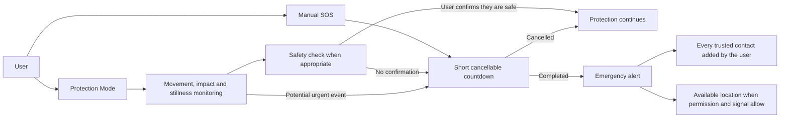
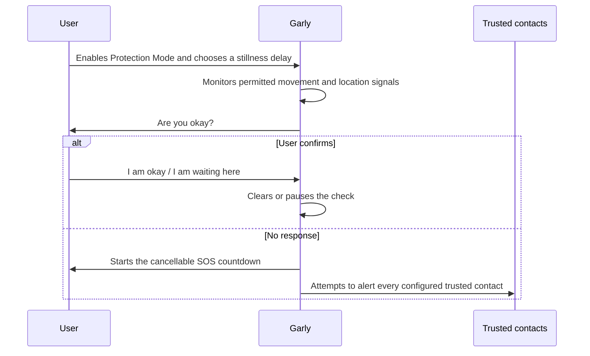
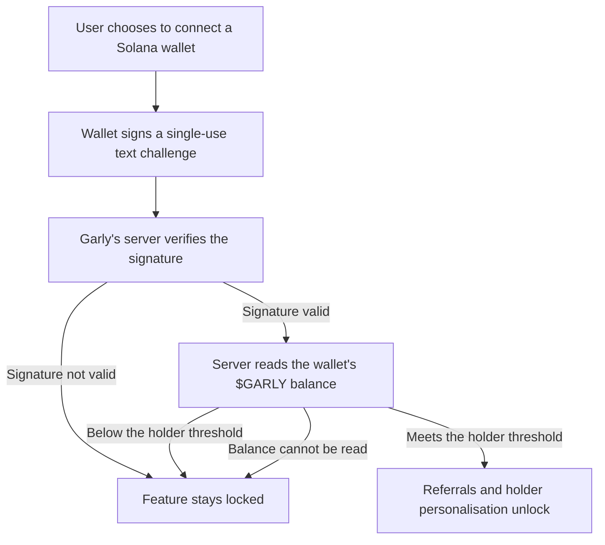

# How Garly works

This document provides a high-level description of Garly's current public beta and Android testing experience. It is intended to help users, testers and reviewers understand the product without publishing proprietary detection thresholds, calibration methods or production infrastructure.

## Two ways to ask for help

Garly provides a direct manual path and an assisted protection path. The manual SOS does not depend on AI, learned routines or sensor timing..

### Manual SOS

The red SOS button is available for situations where the user wants immediate control. It can be used without enabling Protection Mode. After a short cancellable countdown, Garly attempts to alert every trusted contact the user has added and includes the available location when possible.

### Protection Mode

Protection Mode is an optional monitoring session. When enabled, Garly uses the device signals that are available and permitted to look for meaningful changes associated with movement, impacts and prolonged stillness. A visible Android foreground service supports monitoring while the testing app is in the background.

Automatic detection is experimental. Garly includes confirmation and cancellation steps where appropriate to reduce unnecessary alerts, but no detection system can guarantee that every emergency will be identified or that every false alarm will be prevented.

## Activity and carrying profiles

Different activities can produce very different motion patterns. Garly therefore lets the user select a profile rather than treating every movement in the same way.

| Profile | User-facing purpose |
| --- | --- |
| Everyday | General walking, commuting and normal daily movement |
| Jogging | Accounts for repeated running movement while still watching for unusual events |
| Bag | Supports testing when the phone is carried inside a bag rather than in the hand |
| Stillness check | Lets the user choose when prolonged lack of meaningful movement should trigger a safety confirmation |

Bag and jogging calibration are designed to adapt the experience to the user's device placement and real movement. The underlying signal combinations, thresholds and calibration rules are intentionally not published.

## Stillness safety check

While Protection Mode is active, the user can choose how long Garly should wait without meaningful movement or GPS displacement before asking whether they are safe.

Vehicle movement and GPS displacement can help reset the stillness timer when those signals are available. This is especially relevant when the phone is in a bag or the user is travelling.

## Trusted contacts

Trusted contacts are selected by the user. When an emergency alert is completed, Garly attempts to notify every trusted contact added to the account, not only the first contact. Delivery and location accuracy can depend on connectivity, device permissions and third-party messaging availability.

## AI companion and private memory

Garly's companion can support conversations, optional memories and routines chosen by the user. These features are separate from the manual SOS path: the user never needs to wait for the AI to decide whether the red SOS button can be used.

Private memory is optional and includes user controls to review or delete saved information. More detail is available in the [privacy model](PRIVACY_MODEL.md).

## Community rewards and personalisation

Garly's safety features are not for sale. The manual SOS, Protection Mode, trusted contacts and emergency alerts are always available, and none of them depend on holding a token, earning points or inviting anyone. Rewards, referrals and appearance options are optional extras that sit outside the emergency path.

Emergency actions and crisis disclosures never generate rewards. Asking for help is not treated as activity to be farmed.

### Garly Points

Garly Points are off-chain beta units recorded in the user's account to reflect eligible beta activity. They are not a currency, a tradable balance or a promise of future value.

### $GARLY holders

$GARLY is Garly's community token on Solana. Holding at least 10,000 $GARLY unlocks the Referrals screen and holder-only personalisation such as alternative layouts, backgrounds and themes. Core safety stays free regardless of holdings.

### How a wallet is verified

To apply a holder benefit, Garly needs confidence that the person using the account actually controls the wallet being claimed.

- The wallet signs a short single-use text challenge. This is a message signature, not a transaction.
- The signature cannot move, spend, stake or approve funds.
- Garly never asks for a seed phrase or a private key, and never requests a token approval.
- Only the wallet's public address is retained, and the user can disconnect it.

Both the signature check and the balance read happen on Garly's servers. The browser is never trusted to report its own holdings, so an unlock cannot be granted by editing the page on the user's own device. If the balance cannot be read, the check fails closed and the feature stays locked rather than opening by default.

### Garly Safety Pool

The Safety Pool is an optional, non-custodial emergency fund shared with people the user trusts. It uses a Solana multisig in which every member connects and approves with their own wallet. Garly never creates, receives or stores a seed phrase or private key for a pool, and cannot move pool funds on its own. This feature is in limited testing and is not yet generally available.

## Current limitations

- Garly is in public beta and Android testing.
- Automatic detection remains experimental and requires real-device testing.
- Background behavior depends on Android permissions and device power-management settings.
- Location and message delivery depend on permission, signal, connectivity and external services.
- Planned short event recording is not active in the current prototype and will require explicit user choice before release.
- Rewards, referrals, holder personalisation and the Safety Pool are experimental beta features and may change.
- Garly is not a replacement for emergency services, medical assistance or local authorities.

## Information intentionally not published

For user safety, project security and protection of Garly's original work, this repository does not document sensor-fusion formulas, numeric thresholds, calibration algorithms, anti-abuse controls, private API endpoints, production topology, credentials or signing material.
