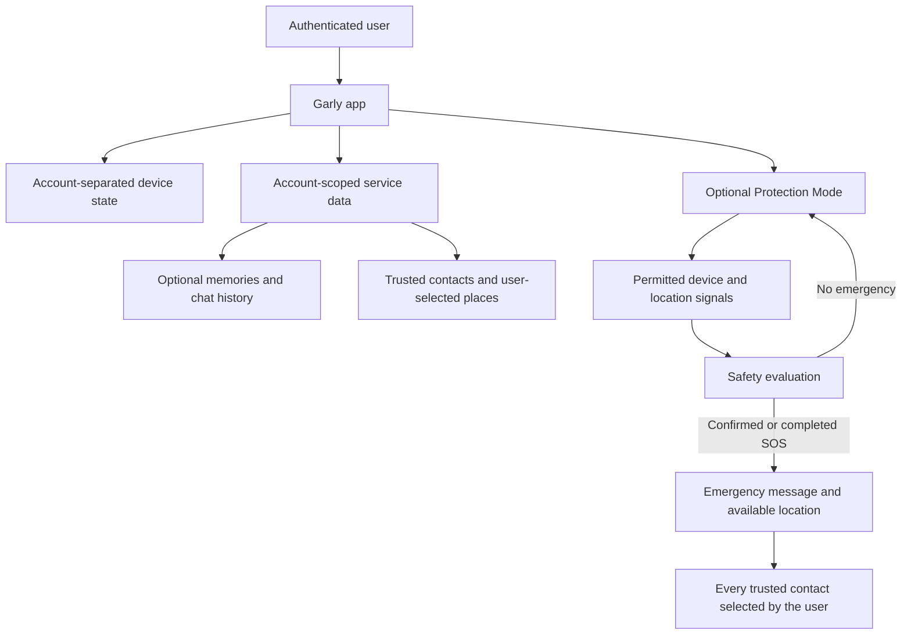

# Garly privacy model

Garly is designed around user choice, account-level separation and limited sharing of safety information. This document describes the product model at a high level; it does not expose private infrastructure or security controls that could weaken the service.

## Core principles

1. **User choice:** optional memory, saved places, trusted contacts and Protection Mode are controlled by the user.
2. **Account isolation:** account data is scoped to the authenticated user rather than shared as one global application state.
3. **Local separation:** device-side state is separated by account, and account-bound interface state is cleared when the active account changes.
4. **Limited emergency sharing:** an SOS shares the emergency message and available location with the trusted contacts selected by the user.
5. **Visible protection:** Android background monitoring uses a visible foreground-service notification rather than hidden monitoring.
6. **User controls:** users can disable optional memory and access available export or deletion controls.

## Conceptual data flow

This diagram shows product responsibilities, not the private network architecture.

## Data categories and user controls

| Data category | Why Garly uses it | User control |
| --- | --- | --- |
| Account identity | Authentication and separation of account data | Sign in, sign out and account-security controls |
| Chat and optional memory | Companion conversations and information the user chooses to retain | Memory can be disabled; available history and memory controls include deletion and export |
| Trusted contacts | Delivery of user-requested or confirmed emergency alerts | The user adds, edits and removes contacts |
| Saved places and routines | User-selected context and safety preferences | Created and managed by the user |
| Motion and orientation signals | Active Protection Mode and calibration on supported devices | Protection Mode is optional and requires device permission where applicable |
| Location | Safety checks, user-selected place features and available SOS location | Controlled through device permission; saved places are chosen by the user |
| Privacy Lock PIN | Additional device-level protection for sensitive areas | Optional six-digit PIN; stored as a one-way verification value for that account on that device |

## Account changes

When the authenticated account changes, Garly's account-bound interface state must not carry information from the previous user into the new session. Device storage used by the app is namespaced by the authenticated account, and server requests rely on the authenticated identity rather than a client-supplied account selection.

These boundaries cover sensitive areas such as chats, memories, contacts, saved places, routines, rewards and progression state.

## Emergency sharing

An emergency flow is intentionally different from ordinary companion use:

- The manual SOS can be started without AI or Protection Mode.
- Automatic protection uses confirmation or a cancellable countdown where appropriate.
- Once the SOS completes, Garly attempts to alert every trusted contact configured by the user.
- The alert can include the available location when location permission, signal and connectivity allow it.
- Garly does not claim that delivery or location accuracy is guaranteed in every environment.

## Recording

The current prototype does not record audio or video as part of the emergency flow. A possible short event-recording feature is being evaluated. If introduced, it is intended to be optional, clearly indicated and limited to an emergency event rather than continuous recording.

## Public transparency and private security

The public repository includes reviewed documentation and selected Android client source for transparency and community feedback. It intentionally excludes:

- production credentials and signing keys;
- private analytics and operational data;
- backend source and deployment configuration;
- private endpoints and infrastructure topology;
- detailed detection, calibration and anti-abuse logic.

Security problems should be reported through GitHub's private vulnerability reporting feature, as described in [`SECURITY.md`](../SECURITY.md), rather than through a public issue.

## Safety notice

Privacy protections reduce risk but cannot make any connected service immune to every failure or attack. Garly remains an experimental safety product and is not a replacement for emergency services or local authorities.
